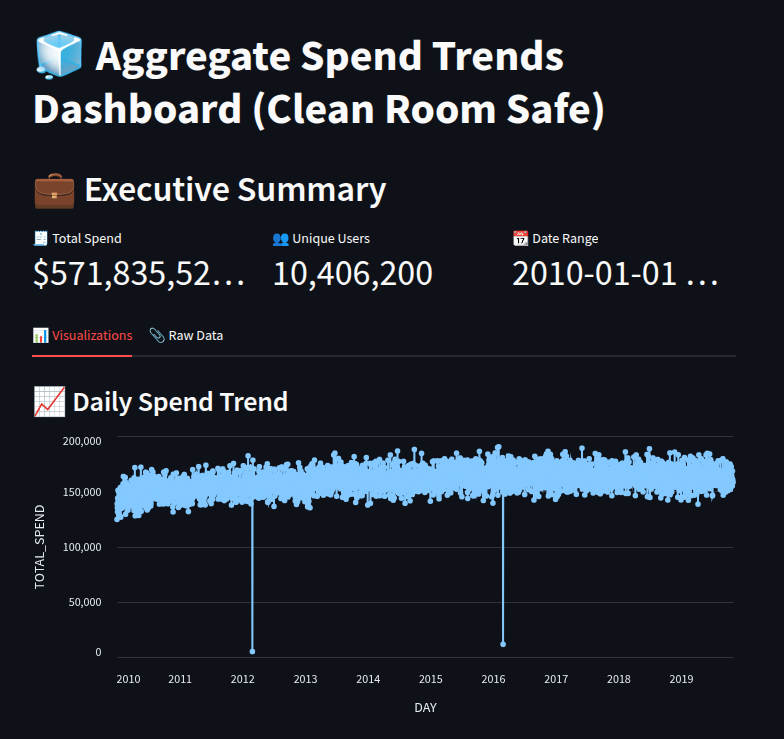
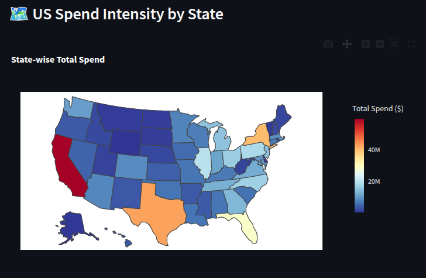

# 🔐 Clean Room-Based Secure Data Sharing & Visualization

This project enables secure data sharing using Snowflake and AWS, ensuring privacy-preserving analytics. It includes a fully automated ingestion pipeline and an interactive Streamlit dashboard for visualizing aggregated trends.

---

## 🚀 Features

- **Automated Ingestion Pipeline**
  - Processes and cleans raw transaction data.
  - Uploads data to S3 and ingests into Snowflake using external stages and tasks.

- **Secure Clean Room Access**
  - Uses Snowflake views to simulate clean room aggregation.
  - Prevents exposure of row-level data.

- **Interactive Dashboard**
  - Built with Streamlit, Altair, and Plotly.
  - Visualizes spend trends, top merchant categories, and regional heatmaps.

---

## 🛠️ Tech Stack

- **Backend/Data Pipeline**: Python, Boto3, Snowflake Connector, CSV
- **Cloud**: AWS S3, Snowflake Warehouse & Stages
- **Dashboard**: Streamlit, Plotly, Altair, Pandas

---

## 📸 Sample Dashboard Screenshots

| Executive Summary | Choropleth Map |
|-------------------|----------------|
|  |  |

---

## 🗂️ Folder Structure

```
.
├── configs/                  # AWS and Snowflake credentials
│   ├── aws_config.json
│   └── snowflake_config.json
├── data/                     # Contains raw and processed transaction data
├── logs/                     # Logs for pipeline execution
├── dashboard.py              # Streamlit dashboard application
├── setup.py                  # Data processing and ingestion pipeline
├── requirements.txt          # Python dependencies
└── README.md                 # You're here!
```

---

## ⚙️ Setup Instructions

### 1. Clone the Repository

```bash
git clone https://github.com/kaustubhuk8/DataShare.git
cd DataShare
```

### 2. Install Dependencies

```bash
pip install -r requirements.txt
```

### 3. Add Configuration Files

Create the following JSON files under `configs/`:

- `aws_config.json`

```json
{
  "aws_access_key_id": "YOUR_AWS_ACCESS_KEY",
  "aws_secret_access_key": "YOUR_AWS_SECRET_KEY",
  "region": "us-west-2",
  "bucket_name": "your-bucket-name"
}
```

- `snowflake_config.json`

```json
{
  "account": "your_account",
  "username": "your_username",
  "password": "your_password",
  "database": "your_db",
  "schema": "PUBLIC",
  "warehouse": "your_wh",
  "table": "transactions_raw",
  "stage": "transactions_stage"
}
```

### 4. Run the Pipeline

```bash
python setup.py
```

---

## 📊 Launch Dashboard

```bash
streamlit run dashboard.py
```

- Interactive filters for date, region, and merchant category.
- Line charts, heatmaps, and bar graphs to visualize spend data.
- CSV export of filtered data.

---

## 🤝 Contributing

1. Fork this repo
2. Create a feature branch
3. Commit your changes
4. Push your branch
5. Submit a PR

---

## 📄 License

This project is licensed under the MIT License.
